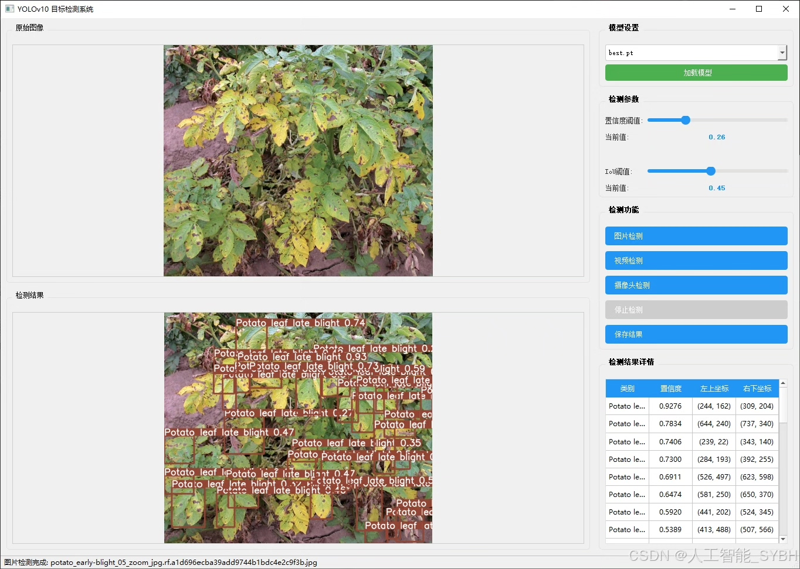
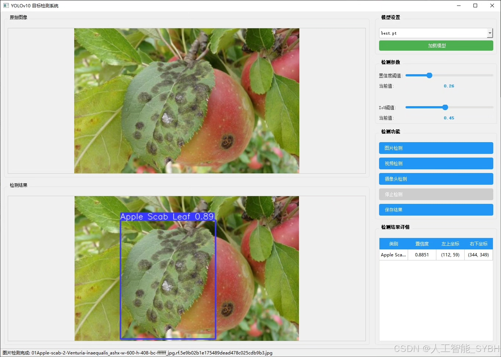
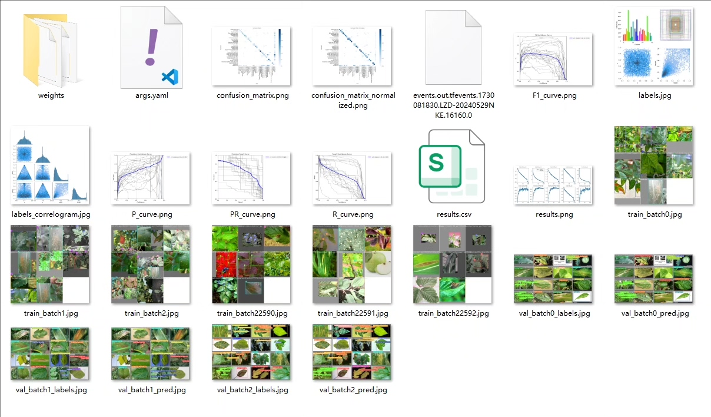
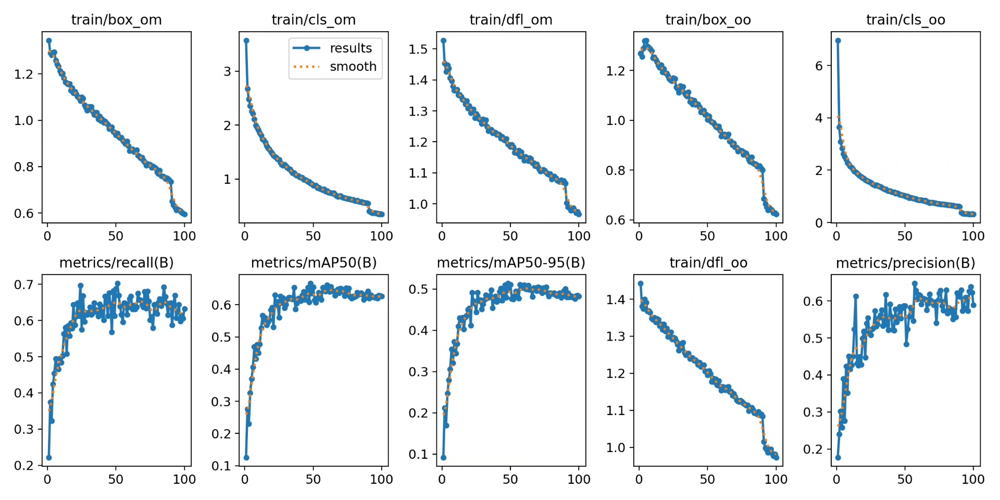
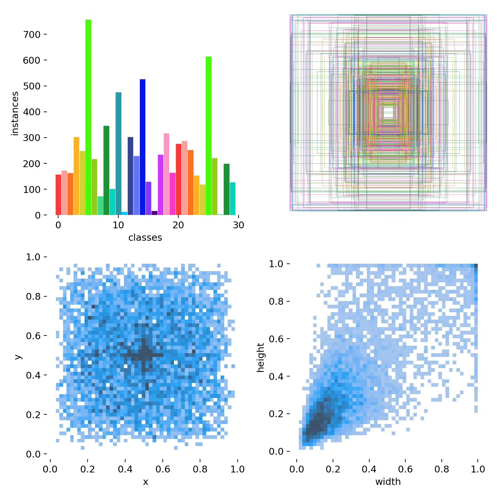
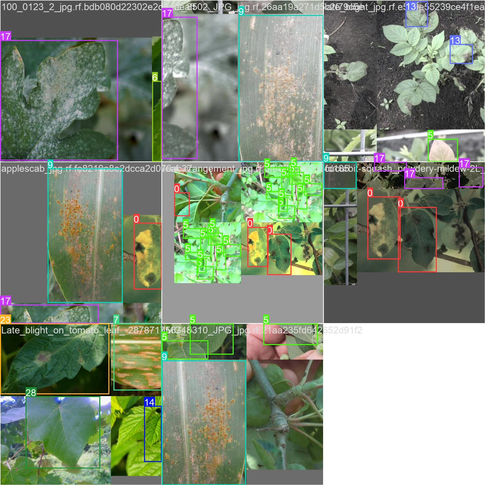
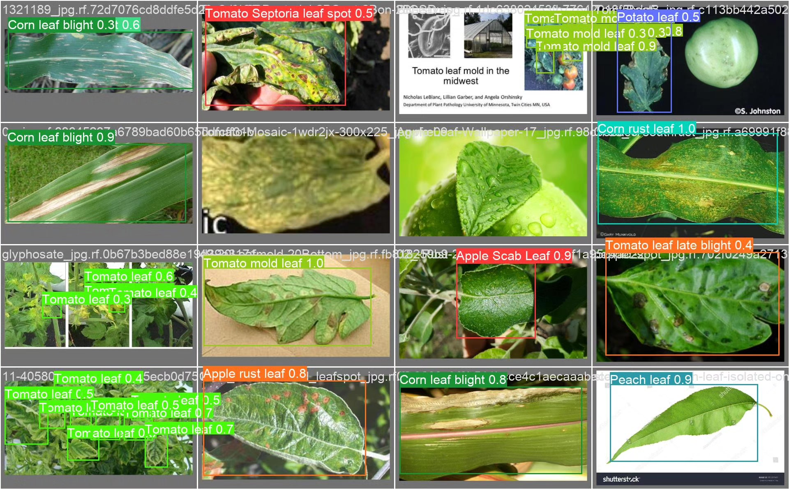
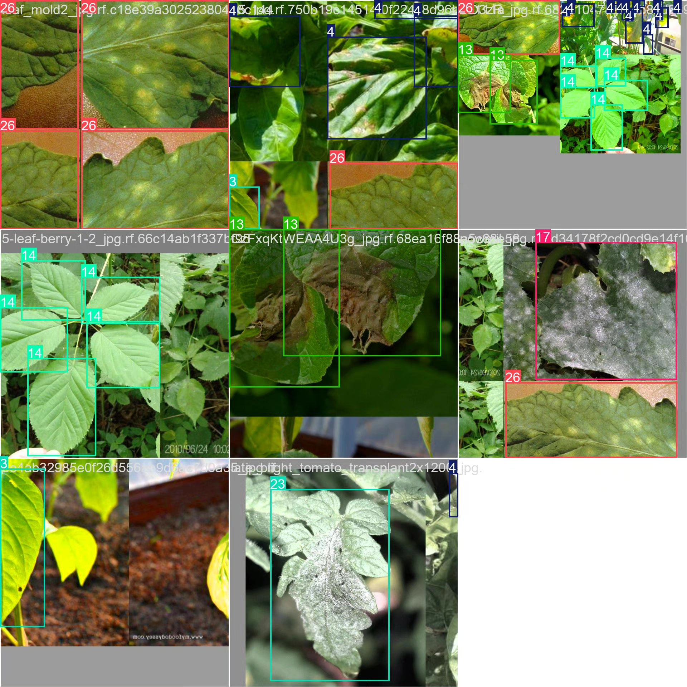

# Plant disease detection system based on YOLOv10 deep learning

## Body

Based on the YOLOv10 deep learning, a plant disease detection system (YOLOv10+YOLO dataset + UI interface + Python project source code + model) is developed.

The purpose of this project is to develop a plant disease detection system based on deep learning, using the YOLOv10 object detection model, which can accurately and precisely identify and classify various plant leaf diseases. The system supports real-time camera detection and image/video detection, has strong practicality and extensibility, and is suitable for agricultural disease monitoring and farmland management and other practical scenarios.

Number of images:
Training set: 2009 images
Validation set: 246 images

The company's products have obtained the YOLO official commercial license certification.

Package after-sales service

After payment, we will provide WeChat ID, answer questions anytime.

Environment configuration: A tutorial on environment configuration will be provided, and WeChat will provide answers.
Remote installation service: If you need remote configuration, an additional fee of 69 is charged,
If the configuration fails, all fees are refunded (specially for old computers only refund installation fees)

Retraining dataset: After configuring the environment, you can train on your own computer.
If you need us to retrain, just pay 69 + computing power fees (2.5 yuan/hour)

Full package after-sales service

## Images

## Payment

Here is a pay link on Stripe ( https://buy.stripe.com/3cs8yP7sY87d0vu9AB ). Please contact me lonlonago@foxmail.com after funding $89, and I will send you a complete data files , thank you!

